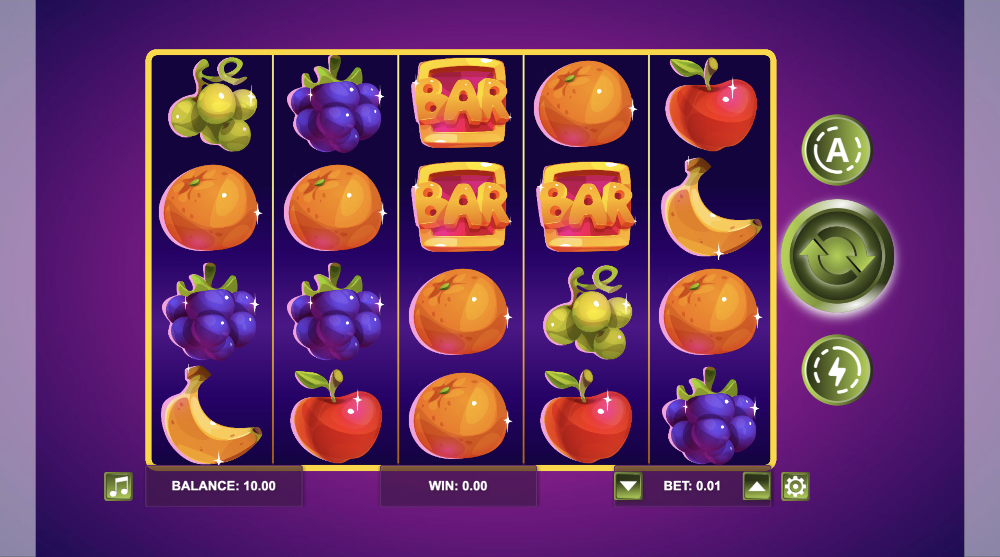

# Write the README.md file
readme_content = '''# 🎰 Cool Slot Machine



> A fun, customizable fruit slot machine built with HTML, CSS & JavaScript.


---

## 🚀 Table of Contents

- [About](#about)  
- [Features](#features)  
- [Demo](#demo)  
- [Installation](#installation)  
- [Usage](#usage)  
- [Customization](#customization)  
- [Project Structure](#project-structure)  
- [Contributing](#contributing)  
- [License](#license)  
- [Author](#author)  

---

## 📖 About

This is a sleek, animated fruit slot machine game.  
Spin the reels, match the fruits (or BAR icons), and win big!  
Perfect for practicing DOM manipulation, CSS animations, and simple game logic.

---

## ✨ Features

- **5 Reels, 4 Rows** layout  
- **Fruit Icons**: grapes, oranges, bananas, apples  
- **BAR Symbol** special icon  
- **Configurable** bet amount & balance  
- **Sound Effects** toggle  
- **Responsive** for desktop & mobile  

---

## 🎬 Demo

  
*(Press the green ▶️ spin button to play.)*

---

## 🛠 Installation

1. **Clone** this repo  
   ```bash
   git clone https://github.com/yourusername/cool-slot-machine.git
   cd cool-slot-machine
   ```

2. **Install** dependencies  
   ```bash
   npm install
   ```

3. **Run** in development  
   ```bash
   npm start
   ```
   This will launch on `http://localhost:8080` by default.

4. **Build** for production  
   ```bash
   npm run build
   ```

---

## ⚙️ Usage

- Adjust **BET** using the ▲▼ buttons.  
- Click the large **Spin** button to play.  
- Your **Balance** and **Win** are displayed at the bottom.  
- Toggle **Sound** on/off with the music icon.

---

## 🎨 Customization

- Swap out `src/assets/*.png` with your own fruit or icon graphics.  
- Edit reel counts, symbols, or win logic in `src/slotMachine.js`.  
- Tweak styles in `src/styles.css` to match your brand.

---

## 🗂 Project Structure

```
testsLOTS/
├─ dist/
├─ node_modules/
├─ src/
│  ├─ assets/
│  │  └─ slot-machine.png
│  ├─ index.html
│  ├─ slotMachine.js
│  └─ styles.css
├─ .babelrc
├─ .gitignore
├─ package.json
├─ package-lock.json
├─ README.md
└─ webpack.config.js
```

---

## 🤝 Contributing

1. Fork the repo  
2. Create a feature branch (`git checkout -b feature/AwesomeFeature`)  
3. Commit your changes (`git commit -m 'Add awesome feature'`)  
4. Push to the branch (`git push origin feature/AwesomeFeature`)  
5. Open a Pull Request  

---

## 📜 License

Distributed under the MIT License. See [LICENSE](LICENSE) for more information.

---

## 👤 Author

**Aleksandar Loncar**  
- GitHub: [@yourusername](https://github.com/gorstak17)  
- Twitter: [@yourhandle](https://twitter.com/yourhandle)

---

Enjoy spinning! 🎉
'''

# Write to file
dirpath = '/mnt/data'
filepath = f'{dirpath}/README.md'
with open(filepath, 'w') as f:
    f.write(readme_content)

print(f"README.md successfully written to {filepath}")
